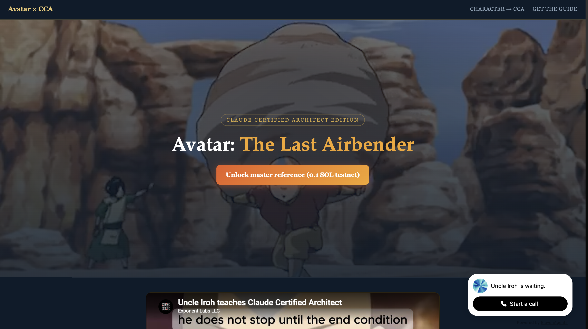

<p align="center">
  
</p>

<p align="center">
  <em>“You must master the basics before you bend lightning—or settle a payment on-chain.”</em><br/>
  <sub>— A note from Uncle Iroh to Aang, on patience, ledgers, and tea money</sub>
</p>

<p align="center">
  
  &nbsp;
  
  &nbsp;
  
  &nbsp;
  
  &nbsp;
  
  &nbsp;
  
  &nbsp;
  
  &nbsp;
  
</p>

<p align="center">
  <a href="https://avatar-solana-claude-architect.netlify.app/" title="Open the live Solana MPP demo">
    
  </a>
  <br />
  <sub>
    <strong>Live demo:</strong>
    <a href="https://avatar-solana-claude-architect.netlify.app/">avatar-solana-claude-architect.netlify.app</a>
    — click the image to open the site.
  </sub>
</p>

<br/>

# @solana/mpp

Aang—before you rush toward the destination, **breathe**. This repository holds the **Solana** path for the [Machine Payments Protocol](https://mpp.dev): a way for any HTTP API to ask for payment with **`402 Payment Required`**, then to **trust—but verify**—that value moved on-chain.

Like learning each **element** in turn, you will meet **three** companions here:

| Companion | What it is |
| --- | --- |
| **Solana** | Fast settlement, real signatures, a ledger that does not forget—though we may still **simulate** before we leap. |
| **MPP** | The **protocol of the open door**: challenge, pay, receipt—so a server may serve **after** the traveler proves their offering. |
| **Claude Certified Architect (CCA)** | The **study** framing in our demo: pay a modest testnet toll, receive the **master markdown**—knowledge offered only after discipline (and a confirmed transaction). |

The world of **Avatar: The Last Airbender** reminds us: **balance** matters. So does **replay protection**—we do not let the same proof unlock the gate twice.

<br/>

> [!IMPORTANT]
> The river is still carving its bed. This repository is under active development. The [Solana MPP spec](https://github.com/tempoxyz/mpp-specs/pull/188) is not yet finalized—**APIs and wire formats may change**. Even the wisest tea master revises the recipe.

<br/>

## What MPP does (in plain air)

**MPP** follows [an open protocol proposal](https://paymentauth.org) so **HTTP** and **money** can speak politely:

- The **client** knocks: `GET /something/precious`.
- The **server** may answer **402** with a **challenge**—*how much*, *to whom*, *which mint*, *which cluster*.
- The **client** builds a Solana transaction, **signs** it like a seal on a scroll.
- The **server** **confirms** the transfer, **records** the signature so it cannot be reused, and returns **200**—often with a **`Payment-Receipt`** header.

That is the **path**. The **SDK** is the **tea set**: it does not replace your discipline; it keeps the ritual consistent.

<br/>

## MPP + Solana: technical map

| Topic | Detail |
| --- | --- |
| **Package** | `@solana/mpp` — shared schemas; `@solana/mpp/server` and `@solana/mpp/client` for charge + session |
| **Charge modes** | **Pull** (`type="transaction"`, default): server simulates, may co-sign fees, broadcasts. **Push** (`type="signature"`): client broadcasts first; server verifies by signature |
| **Assets** | Native **SOL** and **SPL** tokens (USDC, PYUSD, Token-2022, …) |
| **Fee sponsorship** | Optional: server can pay fees so the user signs only what they must |
| **Splits** | One charge, multiple recipients—like dividing dumplings fairly at the table |
| **Replay protection** | Consumed transaction signatures are remembered—**no second cup from the same leaves** |
| **Deeper lore** | See [docs/mpp-system-overview.md](docs/mpp-system-overview.md) for the full story of how the pieces fit |

<br/>

## Demo: testnet anchor (Solscan)

When you run the Avatar CCA flow on **Solana Testnet**, you can inspect the **recipient** account on-chain:

| Item | Link |
| --- | --- |
| **Solscan (testnet)** | [68qBsheVJSzrjFtBReiG8EHx8D7QcX9R45epJAN9oFSK](https://solscan.io/account/68qBsheVJSzrjFtBReiG8EHx8D7QcX9R45epJAN9oFSK?cluster=testnet) |

<br/>

## Install

Like warming the pot before the leaves:

```bash
pnpm add @solana/mpp
```

<br/>

## Features

**Charge (one-time payments)**

- Native SOL and SPL token transfers (USDC, PYUSD, Token-2022, etc.)
- Two settlement modes: pull (`type="transaction"`, default) and push (`type="signature"`)
- Fee sponsorship: server pays transaction fees on behalf of clients
- Split payments: send one charge to multiple recipients in a single transaction
- Replay protection via consumed transaction signatures

**General**

- Works with [ConnectorKit](https://www.connectorkit.dev), `@solana/kit` keypair signers, and [Solana Keychain](https://github.com/solana-foundation/solana-keychain) remote signers
- Server pre-fetches `recentBlockhash` to save client an RPC round-trip
- Transaction simulation before broadcast to prevent wasted fees
- Optional `tokenProgram` hint; clients resolve the mint owner and fail closed if discovery fails

<br/>

## Architecture

```
mpp-sdk/
├── typescript/                    # TypeScript SDK
│   └── packages/mpp/src/
│       ├── Methods.ts             # Shared charge + session schemas
│       ├── constants.ts           # Token programs, USDC mints, RPC URLs
│       ├── server/
│       │   ├── Charge.ts          # Server: challenge, verify, broadcast
│       │   └── Session.ts         # Server: session channel management
│       ├── client/
│       │   ├── Charge.ts          # Client: build tx, sign, send
│       │   └── Session.ts         # Client: session lifecycle
│       └── session/
│           ├── Types.ts           # Session types and interfaces
│           ├── Voucher.ts         # Voucher signing and verification
│           ├── ChannelStore.ts    # Persistent channel state
│           └── authorizers/       # Pluggable authorization strategies
├── rust/                          # Rust SDK (coming soon)
│   └── src/lib.rs
└── demo/                          # Interactive playground
```

**Exports:**

| Export | Purpose |
| --- | --- |
| `@solana/mpp` | Shared schemas, session types, authorizers |
| `@solana/mpp/server` | Server-side charge + session, `Mppx`, `Store` |
| `@solana/mpp/client` | Client-side charge + session, `Mppx` |

<br/>

## Quick Start

### Charge (one-time payment)

**Server:**

```ts
import { Mppx, solana } from '@solana/mpp/server'

const mppx = Mppx.create({
  secretKey: process.env.MPP_SECRET_KEY,
  methods: [
    solana.charge({
      recipient: 'RecipientPubkey...',
      currency: 'EPjFWdd5AufqSSqeM2qN1xzybapC8G4wEGGkZwyTDt1v',
      decimals: 6,
    }),
  ],
})

const result = await mppx.charge({
  amount: '1000000', // 1 USDC
  currency: 'USDC',
})(request)

if (result.status === 402) return result.challenge
return result.withReceipt(Response.json({ data: '...' }))
```

**Client:**

```ts
import { Mppx, solana } from '@solana/mpp/client'

const mppx = Mppx.create({
  methods: [solana.charge({ signer })], // any TransactionSigner
})

const response = await mppx.fetch('https://api.example.com/paid-endpoint')
```

### Fee Sponsorship (charge)

The server can pay transaction fees on behalf of clients:

```ts
// Server — pass a TransactionPartialSigner to cover fees
solana.charge({
  recipient: '...',
  signer: feePayerSigner, // KeyPairSigner, Keychain SolanaSigner, etc.
})

// Client — no changes needed, fee payer is handled automatically
```

<br/>

## How It Works

### Charge Flow

1. Client requests a resource
2. Server returns **402 Payment Required** with a challenge (`recipient`, `amount`, `currency`, optional `tokenProgram`, optional `recentBlockhash`)
3. Client builds and signs a Solana transfer transaction
4. Server simulates, broadcasts, confirms on-chain, and verifies the transfer
5. Server returns the resource with a `Payment-Receipt` header

With fee sponsorship, the client partially signs (transfer authority only) and the server co-signs as fee payer before broadcasting.

### Splits (charge)

Use `splits` when one charge should pay multiple recipients in the same asset.
The top-level `amount` is the total paid. The primary `recipient` receives
`amount - sum(splits)`, and each split recipient receives its own `amount`.

```ts
import { Mppx, solana } from '@solana/mpp/server'

const mppx = Mppx.create({
  secretKey: process.env.MPP_SECRET_KEY,
  methods: [
    solana.charge({
      recipient: 'SellerPubkey...',
      currency: 'EPjFWdd5AufqSSqeM2qN1xzybapC8G4wEGGkZwyTDt1v',
      decimals: 6,
      splits: [
        { recipient: 'PlatformPubkey...', amount: '50000', memo: 'platform fee' },
        { recipient: 'ReferrerPubkey...', amount: '20000', memo: 'referral fee' },
      ],
    }),
  ],
})

const result = await mppx.charge({
  amount: '1000000', // total: 1.00 USDC
  currency: 'EPjFWdd5AufqSSqeM2qN1xzybapC8G4wEGGkZwyTDt1v',
})(request)
```

In this example:

- seller receives `930000`
- platform receives `50000`
- referrer receives `20000`

The same `splits` shape works for native SOL charges.

<br/>

## Demo (Avatar CCA + playground)

A React + Express demo—**two paths up the mountain**:

| Route | What you find |
| --- | --- |
| **`/`**, **`/study-guide`** | Avatar CCA landing, video, **Phantom** on **testnet**, pay **0.10 SOL** via MPP, unlock **`avatar-the-last-airbender-master.md`** |
| **`/charges`** | API playground (keypair, **402 → pay → retry**) for stock / weather / marketplace |
| **`/landing`** | Standalone marketing page |

The Vite dev server proxies **`/api`** to Express on port **3000**.

**Quick start** (from the repo root; [full instructions](demo/README.md)):

```bash
pnpm demo:install    # or: npm run demo:install
pnpm demo:server     # or: npm run demo:server  — terminal 1, API at http://localhost:3000
pnpm demo:app        # or: npm run demo:app     — terminal 2, UI at http://localhost:5173
```

(`demo:install` runs `pnpm install` inside each demo package, so **pnpm** must be available, or install dependencies manually in `demo/server` and `demo/app`.)

Open **http://localhost:5173** for the paid study-guide experience. Use Phantom on **Solana Testnet** and fund the **Pay from** account shown in the UI (see [demo/README.md](demo/README.md) for ports, env vars, and troubleshooting).

Optional: run [Surfpool](https://surfpool.run) and set `NETWORK=localnet` if you want the stack against a local sim instead of public testnet.

<br/>

## Development

```bash
# TypeScript
cd typescript && pnpm install

just ts-fmt              # Format and lint
just ts-build            # Build
just ts-test             # Unit tests (charge + session, no network)
just ts-test-integration # Integration tests (requires Surfpool)
# Rust
cd rust && cargo build

# Everything
just build            # Build both
just test             # Test both
just pre-commit       # Full pre-commit checks
```

<br/>

## Spec

This SDK implements the [Solana Charge Intent](https://github.com/tempoxyz/mpp-specs/pull/188) for the [HTTP Payment Authentication Scheme](https://paymentauth.org).

Session method docs and implementation notes are intentionally kept out of this
README for now. See [docs/methods/sessions.md](docs/methods/sessions.md).

<br/>

## License

MIT

---

<p align="center">
  <em>“The tea is ready when the leaves have given all they have—and the payment is final when the chain agrees.”</em><br/>
  <sub>May your transactions confirm, and your architecture stay humble.</sub>
</p>
